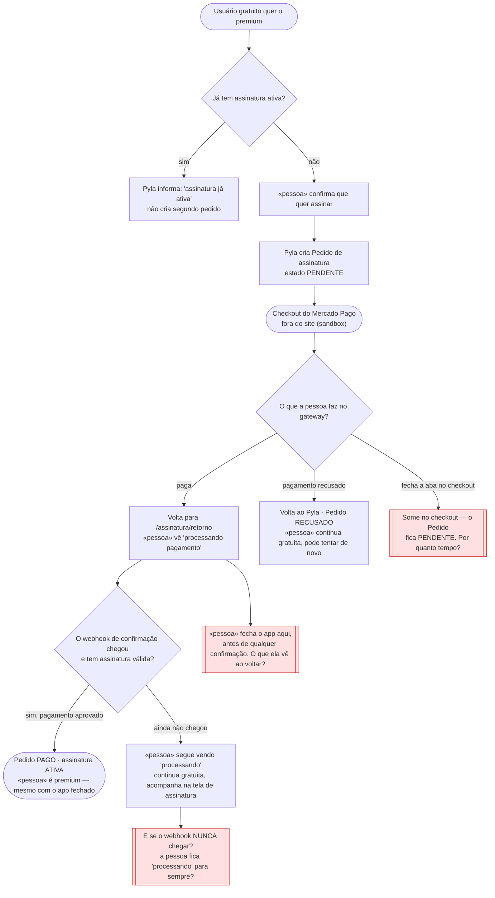
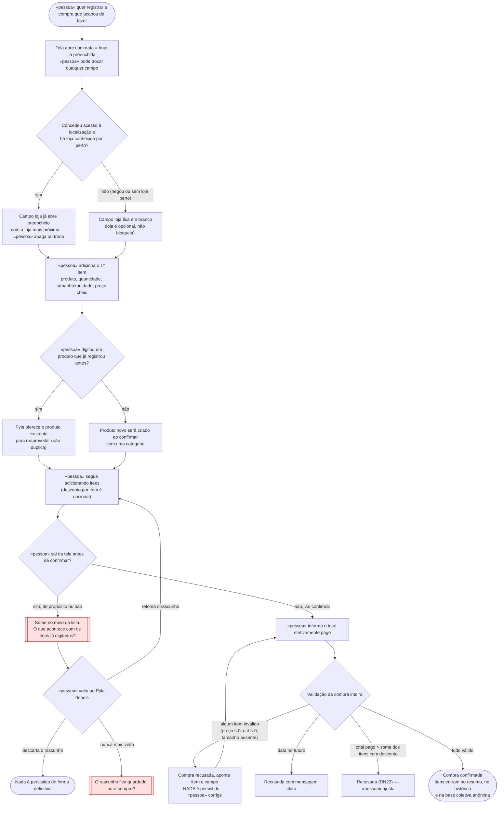

# 🗺️ Jornadas de Usuário

**Projeto:** Pyla — controle de gastos de mercado com comparação colaborativa de preços
**Versão:** 1.0.0 · gerado via `/utf-flows`
**Última atualização:** 2026-09-07 · Jornada 2 adicionada

> 🤖 **Este documento é a fonte da verdade sobre O QUE A PESSOA VIVE na tela** —
> o caminho do primeiro clique até o objetivo, e principalmente os pontos onde ela
> trava, espera ou desiste.
>
> ✍️ **Não preencha na mão:** rode `/utf-flows`. A entrevista escolhe a história que
> merece o desenho, obriga o ponto de desistência a aparecer e cobra a decisão sobre
> ele.
>
> 🚫 **Não duplique:** regra de negócio mora no `prd.md`; estado, entidade e contrato
> moram no `architecture.md`. Aqui mora o caminho.

---

## Jornada 1 — Assinar o premium e ter o pagamento confirmado

**Story:** US06 (assinar o premium) + US07 (confirmação assíncrona via webhook)
**Critérios que ela marca:** sai do site e volta · depende do tempo · depende de outra pessoa (o gateway) · pode ser abandonada — **os quatro**. É por isso que o pagamento recorrente é o exemplo canônico da disciplina.

**O que decidimos sobre o nó vermelho X1 — a pessoa fecha o checkout do Mercado Pago sem pagar:**

Quando a pessoa fecha o checkout do Mercado Pago sem pagar, o Pedido de assinatura fica no estado PENDENTE, e ela continua como usuária gratuita — nenhum acesso premium é liberado. Esse pedido pendente não é eterno: ele tem validade de 24 horas. Enquanto está válido, se a pessoa volta ao Pyla, a tela de assinatura mostra "você tem um pagamento aguardando" e oferece retomar o mesmo checkout ou cancelar — o Pyla não cria um segundo pedido. Passadas as 24 horas sem confirmação, o pedido vira EXPIRADO sozinho e a tela volta a mostrar a oferta do premium do zero.

**O que decidimos sobre o nó vermelho M — a pessoa fecha o app antes de qualquer confirmação:**

A ativação do premium é responsabilidade exclusiva do webhook (RN16, US07), então a pessoa não precisa estar com o app aberto para virar premium. Se ela fecha o Pyla logo depois de pagar e reabre mais tarde, a tela de assinatura mostra o estado real daquele momento: se o webhook já confirmou o pagamento, ela já aparece como premium, sem refazer nada; se a confirmação ainda não chegou, ela vê "processando pagamento" e o pedido pendente com seu prazo. Em nenhum caso o Pyla exige uma ação dela para completar a ativação.

**O nó vermelho L — o webhook de confirmação nunca chega — não foi decidido nesta rodada.** Está em Dúvidas em aberto: o `/utf-architecture` precisa dizer se o Pyla consulta o gateway ativamente para reconciliar pedidos pendentes, ou se depende só do webhook (e nesse caso o pedido apenas expira em 24h, com o risco de alguém ter pago de verdade e a assinatura não ativar).

---

## Jornada 2 — Registrar uma compra item a item

**Story:** US02 (registrar uma compra item a item)
**Critérios que ela marca:** pode ser abandonada no meio — é o cadastro mais longo do produto (`L`), e o rascunho de compra é o ponto de desistência. Não marca "sai do site e volta", "depende do tempo" nem "depende de outra pessoa"; a jornada existe pelo volume de uso e pelo abandono no meio da lista.

**Ponto de fluxo — a tela já abre com valores prováveis, para encurtar o cadastro:**

O registro de uma compra é o cadastro mais longo do Pyla, então a tela abre com o que quase sempre é verdade: a data já vem com o dia de hoje, e o campo loja já vem preenchido com a loja conhecida mais próxima quando a localização foi concedida e há uma por perto. Nada disso é imposto — a pessoa troca a data (se a compra foi outro dia) ou apaga/substitui a loja livremente antes de confirmar. As regras do PRD continuam valendo por cima do valor pré-preenchido: data futura é recusada na confirmação (RN05) e a loja segue opcional (RN09), então deixar o campo em branco não bloqueia o registro.

**O que decidimos sobre o nó vermelho X1 — a tela morre no meio da lista, sem a pessoa salvar de propósito:**

Enquanto a pessoa monta a compra, os itens já digitados ficam guardados no próprio navegador dela, não no servidor. Se a aba fecha de repente — queda de conexão, bateria, fechar sem querer — ela reabre o Pyla no mesmo aparelho e navegador e reencontra a compra em andamento, com os itens até o último que digitou, para retomar ou descartar. Nada disso conta para o resumo do mês, o histórico de preço ou a base coletiva: só a confirmação torna a compra efetiva e a envia ao servidor. Onde exatamente esse rascunho é persistido — só no navegador, também no servidor — é decisão do `architecture.md`; o comportamento que o PRD garante (há um rascunho para retomar ou descartar) vale de qualquer forma.

**O que decidimos sobre o nó vermelho X2 — a pessoa cria o rascunho e nunca mais volta:**

Só existe um rascunho de compra por vez: começar uma compra nova quando já há um rascunho aberto leva a pessoa a decidir entre retomar o existente ou descartá-lo. Isso impede que rascunhos se acumulem. Além disso, um rascunho sem atividade por um prazo (a definir na spec da US02) expira sozinho e é descartado — como o rascunho nunca entrou em resumo, histórico ou base coletiva, nada de real se perde nesse descarte. Na prática, a pessoa nunca volta a uma lista cheia de compras pela metade: no máximo há uma, e ela some se ficar esquecida tempo demais.

---

## Dúvidas em aberto

| # | Dúvida | Onde ela precisa ser resolvida |
| --- | --- | --- |
| 1 | Se o webhook de confirmação de pagamento nunca chega (perdido, gateway fora do ar), a pessoa que pagou de verdade fica presa em "processando". O Pyla consulta o gateway ativamente (polling / rotina de reconciliação dos pedidos PENDENTES) ou depende exclusivamente do webhook? Se depende só do webhook, o pedido expira em 24h e a pessoa é orientada a tentar de novo — assumindo o risco de pagamento feito sem assinatura ativada. | `/utf-architecture` — consistência do estado de pagamento; ciclo de vida do Pedido de assinatura (PENDENTE → PAGO / RECUSADO / EXPIRADO) e se existe um estado/processo de reconciliação. |
| 2 | Prazo exato e regras finas do "pagamento aguardando" (retomar o mesmo checkout do Mercado Pago é sempre possível dentro das 24h? o link do gateway expira antes disso?). | spec da US06. |
| 3 | Onde o Rascunho de compra é persistido: só no navegador da pessoa (não retomável em outro dispositivo), no servidor (retomável de qualquer lugar), ou os dois. O critério da US02 fala em "encontra a compra como rascunho para retomar ou descartar" sem dizer onde — decidimos seguir o comportamento do PRD e deixar a persistência para a arquitetura. | `/utf-architecture` — ciclo de vida do Rascunho de compra (criação, retomada, descarte, expiração) e onde ele vive. |
| 4 | Prazo de inatividade após o qual o rascunho único expira sozinho. | spec da US02. |
